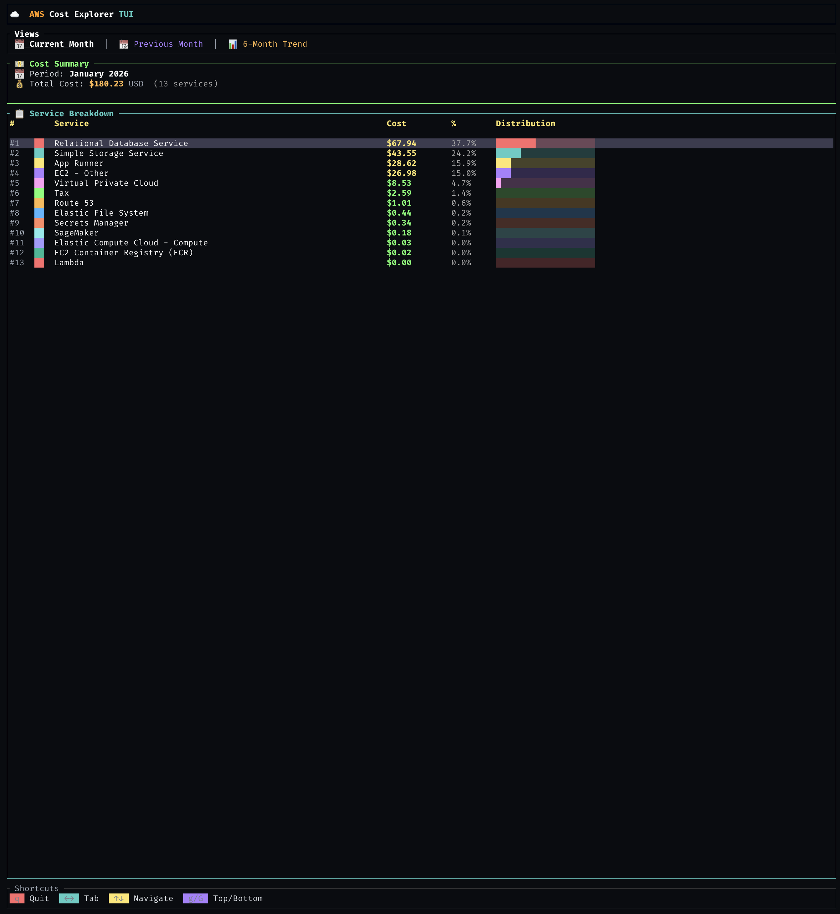

# ☁️ AWS Costs TUI

A beautiful, colorful terminal user interface for viewing your AWS costs from Cost Explorer, built with Rust and Ratatui.



```
┌─────────────────────────────────────────────────────────────────┐
│ ☁️  AWS Cost Explorer TUI                                       │
├─────────────────────────────────────────────────────────────────┤
│  📅 Current Month  │  📆 Previous Month  │  📊 6-Month Trend   │
├─────────────────────────────────────────────────────────────────┤
│ 💵 Cost Summary                                                 │
│   📅 Period: January 2026                                       │
│   💰 Total Cost: $1,234.56 USD  (12 services)                   │
├─────────────────────────────────────────────────────────────────┤
│ 📋 Service Breakdown                                            │
│  #  ██  Service                    Cost        %   Distribution │
│  1  ██  EC2-Instances             $523.45   42.4%  ████████░░░░ │
│  2  ██  RDS                       $312.00   25.3%  █████░░░░░░░ │
│  3  ██  S3                        $156.78   12.7%  ██░░░░░░░░░░ │
│  4  ██  Lambda                     $89.00    7.2%  █░░░░░░░░░░░ │
│  5  ██  CloudWatch                 $45.33    3.7%  ░░░░░░░░░░░░ │
├─────────────────────────────────────────────────────────────────┤
│  q  Quit   ←→  Tab   ↑↓  Navigate   g/G  Top/Bottom            │
└─────────────────────────────────────────────────────────────────┘
```

## ✨ Features

- 📊 **Visual Cost Breakdown** — See costs broken down by AWS service with colorful bars
- 📅 **Current Month View** — Month-to-date costs for the current billing period
- 📆 **Previous Month View** — Compare with last month's costs
- 📈 **6-Month Trend** — Visualize cost trends with per-service breakdown
- 🎨 **12 Vibrant Colors** — Each service gets a unique color for easy tracking
- 💹 **Month-over-Month Change** — See percentage changes (green = savings, red = increase)
- ⌨️ **Vim-style Navigation** — Navigate with `j/k`, `g/G`, arrow keys
- 🔐 **AWS Profile Support** — Use any configured AWS profile
- 📝 **Text Mode** — Non-TUI output for scripting with `--no-tui`

## 🚀 Installation

### Quick Install (if you have Rust)

```bash
cargo install --git https://github.com/ajay-bhargava/aws-costs-tui
```

### From Source

```bash
git clone https://github.com/ajay-bhargava/aws-costs-tui.git
cd aws-costs-tui
cargo install --path .
```

## 📋 Prerequisites

### 1. AWS Credentials

Configure AWS credentials using one of:
- Environment variables (`AWS_ACCESS_KEY_ID`, `AWS_SECRET_ACCESS_KEY`)
- AWS credentials file (`~/.aws/credentials`)
- AWS config file (`~/.aws/config`)

### 2. IAM Permissions

Your AWS user/role needs Cost Explorer access:

```json
{
  "Version": "2012-10-17",
  "Statement": [
    {
      "Effect": "Allow",
      "Action": ["ce:GetCostAndUsage"],
      "Resource": "*"
    }
  ]
}
```

### 3. Cost Explorer Enabled

Cost Explorer must be enabled in your AWS account (enabled by default for most accounts).

## 📖 Usage

```bash
# Launch TUI with default profile
aws-costs

# Use a specific AWS profile
aws-costs --profile production

# Use a specific region
aws-costs --region us-west-2

# Text output without TUI (useful for scripts/piping)
aws-costs --no-tui

# Enable debug logging
aws-costs --debug
```

### Command Line Options

| Option | Short | Description |
|--------|-------|-------------|
| `--profile <PROFILE>` | `-p` | AWS profile to use (default: `default` or `AWS_PROFILE`) |
| `--region <REGION>` | `-r` | AWS region (default: profile region or `us-east-1`) |
| `--no-tui` | | Print costs as text without TUI |
| `--debug` | | Enable debug logging to stderr |
| `--help` | `-h` | Show help message |
| `--version` | `-V` | Show version |

## ⌨️ Key Bindings

| Key | Action |
|-----|--------|
| `q` / `Esc` | Quit |
| `Tab` / `→` | Next tab |
| `Shift+Tab` / `←` | Previous tab |
| `j` / `↓` | Move down |
| `k` / `↑` | Move up |
| `g` | Go to top |
| `G` | Go to bottom |

## 🖥️ Views

### 📅 Current Month
- Total cost summary with service count
- Full service breakdown table with:
  - Rank (#1, #2, etc.)
  - Color indicator for each service
  - Service name
  - Cost (color-coded by magnitude)
  - Percentage of total
  - Visual progress bar

### 📆 Previous Month
Same layout as Current Month for easy comparison.

### 📊 6-Month Trend
- **Grouped bar chart** showing top 8 services over 6 months
- **Color legend** mapping colors to services
- **Monthly totals table** with month-over-month percentage change
  - 🟢 Green = cost decreased
  - 🔴 Red = cost increased

## 🏗️ Architecture

Built following patterns from [taws](https://github.com/huseyinbabal/taws):

```
src/
├── main.rs              # Entry point with CLI parsing (clap)
├── aws/
│   ├── mod.rs           # AWS module exports
│   ├── credentials.rs   # Credential loading (env, profiles)
│   └── cost_explorer.rs # Cost Explorer API with SigV4 signing
└── ui/
    ├── mod.rs           # UI module exports
    └── app.rs           # TUI rendering with Ratatui
```

### Key Design Decisions

- **Lightweight AWS Integration** — Uses `aws-sigv4` for request signing instead of the full AWS SDK (~6.5MB binary)
- **Ratatui TUI** — Modern, actively maintained TUI library
- **Crossterm Backend** — Cross-platform terminal handling (macOS, Linux, Windows)

## 🌍 Environment Variables

| Variable | Description |
|----------|-------------|
| `AWS_PROFILE` | Default AWS profile to use |
| `AWS_REGION` | Default AWS region |
| `AWS_DEFAULT_REGION` | Fallback region if `AWS_REGION` not set |
| `AWS_ACCESS_KEY_ID` | AWS access key (for env-based auth) |
| `AWS_SECRET_ACCESS_KEY` | AWS secret key (for env-based auth) |
| `AWS_SESSION_TOKEN` | AWS session token (for temporary credentials) |

## 🔧 Troubleshooting

### "No credentials found"
Make sure you have AWS credentials configured:
```bash
aws configure
```

### "API request failed with status 403"
Your IAM user/role doesn't have `ce:GetCostAndUsage` permission. Add the required policy.

### "API request failed with status 400"
Cost Explorer might not be enabled, or you're querying a date range with no data.

## 📄 License

MIT License — see [LICENSE](LICENSE) for details.

## 🙏 Acknowledgments

- Inspired by [taws](https://github.com/huseyinbabal/taws) — Terminal UI for AWS
- Built with [Ratatui](https://github.com/ratatui-org/ratatui) — Rust TUI library
- Uses [aws-sigv4](https://github.com/awslabs/aws-sdk-rust) for request signing
